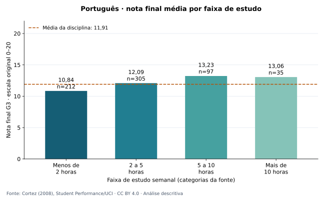
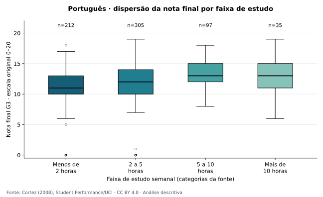
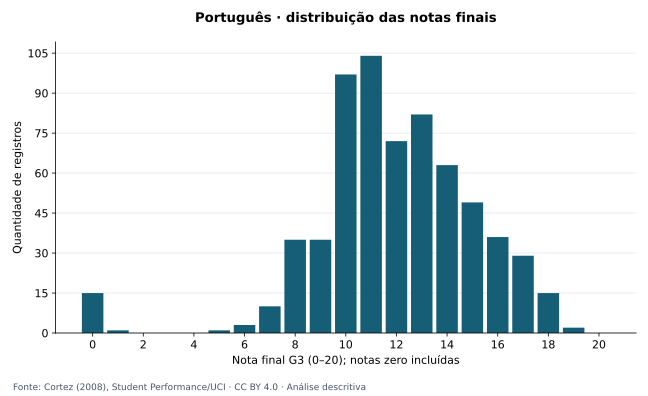
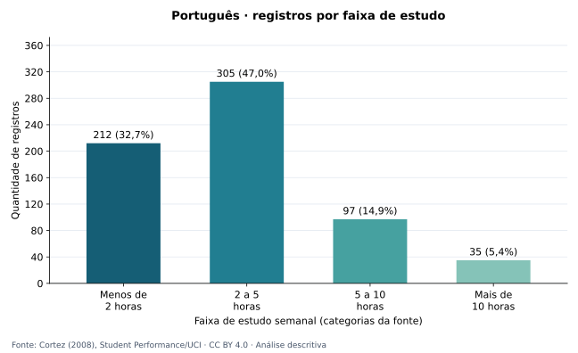
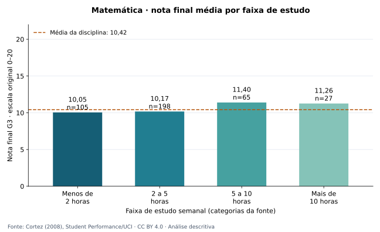
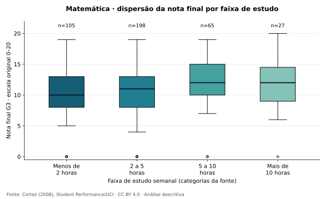
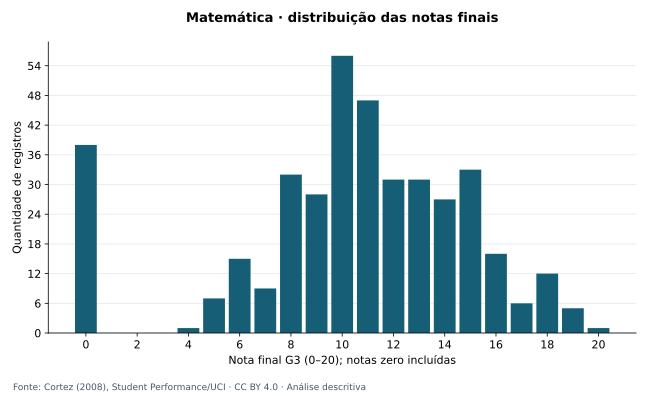
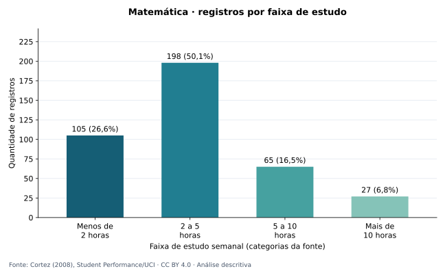

# EDA e visualização — Estudo e desempenho escolar

Português é a análise principal; Matemática é uma comparação separada. A unidade é um registro de aluno por disciplina. Há alunos nos dois arquivos; as contagens não representam pessoas distintas somadas.

## Português

Português: 649 registros; média final 11,91 e mediana 12,00, na escala 0–20.

A maior média observada está na faixa 5 a 10 horas: 13,23 (n=97).

A média na faixa mais de 10 horas é inferior à da faixa 5 a 10 horas. Não há crescimento contínuo das quatro médias.

A diferença entre mais de 10 horas e menos de 2 horas é 2,21 pontos. Os grupos têm tamanhos diferentes (212, 305, 97, 35).

Spearman entre a categoria ordinal de estudo e G3: 0,275. É uma associação descritiva por postos, sem teste de significância e sem interpretação causal.

Foram mantidas 15 notas finais zero. A regra de 1,5 × IQR sinaliza 16 valores atípicos na distribuição geral; eles permanecem na análise.

| Faixa | n | Média G3 | Mediana | DP amostral | Q1 | Q3 | Zero | Atípicos IQR |
|---|---:|---:|---:|---:|---:|---:|---:|---:|
| Menos de 2 horas | 212 | 10,84 | 11,00 | 3,22 | 10,00 | 13,00 | 8 | 10 |
| 2 a 5 horas | 305 | 12,09 | 12,00 | 3,24 | 10,00 | 14,00 | 7 | 8 |
| 5 a 10 horas | 97 | 13,23 | 13,00 | 2,50 | 12,00 | 15,00 | 0 | 0 |
| Mais de 10 horas | 35 | 13,06 | 13,00 | 3,04 | 11,00 | 15,00 | 0 | 0 |

## Matemática

Matemática: 395 registros; média final 10,42 e mediana 11,00, na escala 0–20.

A maior média observada está na faixa 5 a 10 horas: 11,40 (n=65).

A média na faixa mais de 10 horas é inferior à da faixa 5 a 10 horas. Não há crescimento contínuo das quatro médias.

A diferença entre mais de 10 horas e menos de 2 horas é 1,21 pontos. Os grupos têm tamanhos diferentes (105, 198, 65, 27).

Spearman entre a categoria ordinal de estudo e G3: 0,105. É uma associação descritiva por postos, sem teste de significância e sem interpretação causal.

Foram mantidas 38 notas finais zero. A regra de 1,5 × IQR sinaliza 0 valores atípicos na distribuição geral; eles permanecem na análise.

| Faixa | n | Média G3 | Mediana | DP amostral | Q1 | Q3 | Zero | Atípicos IQR |
|---|---:|---:|---:|---:|---:|---:|---:|---:|
| Menos de 2 horas | 105 | 10,05 | 10,00 | 4,96 | 8,00 | 13,00 | 13 | 13 |
| 2 a 5 horas | 198 | 10,17 | 11,00 | 4,22 | 8,00 | 13,00 | 16 | 16 |
| 5 a 10 horas | 65 | 11,40 | 12,00 | 4,64 | 10,00 | 15,00 | 6 | 6 |
| Mais de 10 horas | 27 | 11,26 | 12,00 | 5,28 | 9,00 | 14,50 | 3 | 3 |

## Associações por postos

| Disciplina | Variáveis | n | Spearman |
|---|---|---:|---:|
| Português | studytime × G3 | 649 | 0,275 |
| Português | G1 × G3 | 649 | 0,883 |
| Português | G2 × G3 | 649 | 0,944 |
| Matemática | studytime × G3 | 395 | 0,105 |
| Matemática | G1 × G3 | 395 | 0,878 |
| Matemática | G2 × G3 | 395 | 0,957 |

## Qualidade e rastreabilidade

Reconciliação com o ETL aprovada. Campos analíticos ausentes na base: 0. Registros sinalizados: 0. Exclusões registradas no ETL: 0.

SHA-256 da base tratada: 7bc28aa49e07779de6780dbbe07406e035ceb9c53d6b54ce519f38679229aa7e. ETL registrado em UTC: 2026-10-08T13:56:37.124825+00:00. EDA em UTC: 2026-10-08T14:14:10.717096+00:00.

## Metodologia

Estatísticas calculadas diretamente da base tratada, sem imputação ou remoção de zeros. Quartis por interpolação linear (tipo 7); desvio-padrão amostral (n−1), indisponível para n<2. Boxplots: caixa Q1–Q3, linha da mediana, bigodes até as observações dentro de 1,5 × IQR e pontos além dos bigodes. Pontos sobrepostos podem representar vários registros. Atípicos são sinais para inspeção, não erros nem justificativa automática para exclusão. Os limites IQR são recalculados por grupo; a soma dos atípicos por faixa pode diferir do total da disciplina. Spearman usa postos médios nos empates e fica indisponível para variável constante. Os códigos de estudo não são horas exatas ou intervalos iguais.

## Limitações

Dados observacionais históricos de duas escolas portuguesas. Os grupos têm tamanhos desiguais, e a faixa mais de 10 horas é pequena. Não foram controlados outros fatores. Não se estimaram p-valores ou intervalos de confiança. As diferenças não demonstram causalidade, significância estatística ou representatividade da FATEC.

Fonte: [Cortez (2008), Student Performance/UCI](https://doi.org/10.24432/C5TG7T). Licença: [CC BY 4.0](https://creativecommons.org/licenses/by/4.0/). Resumos e gráficos derivados pelo projeto.
